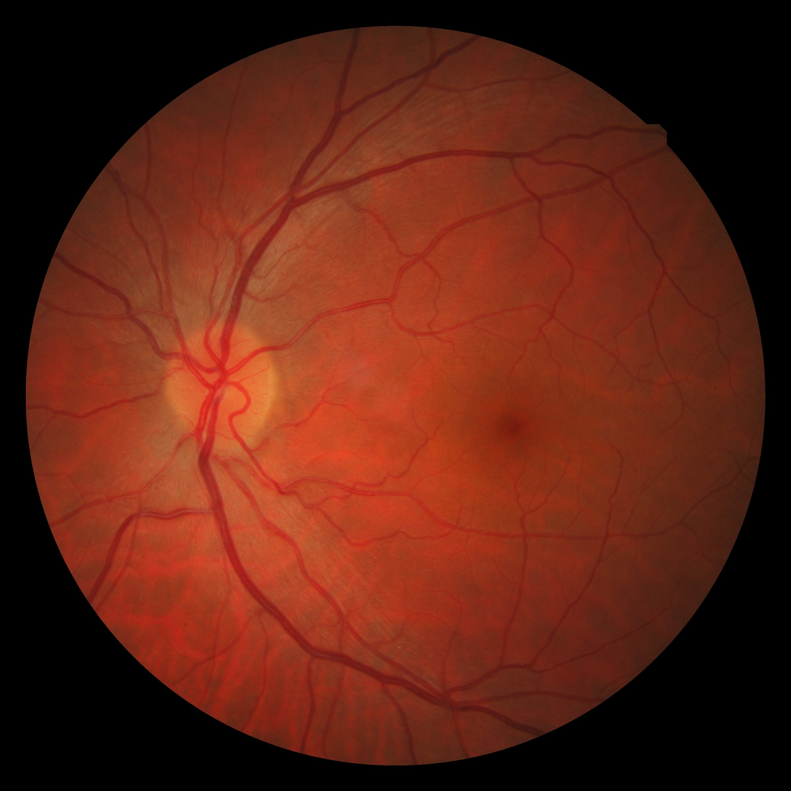
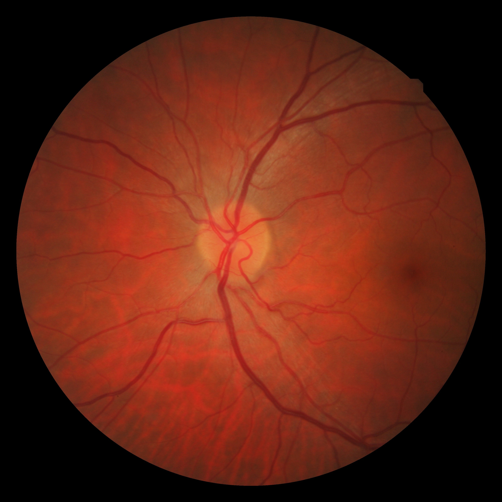
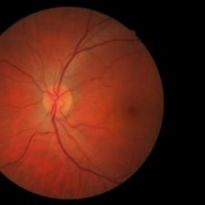

<p align="center">
  <h1 align="center"><ins>EyeLiner</ins><br>Automatic Longitudinal Image Registration using Fundus Landmarks</h1>
  <p align="center">
    <a href="https://www.linkedin.com/in/advaith-veturi/">Advaith Veturi</a>
  </p>
  <h2 align="center">
    <p>ARVO 2024</p>
    <a href="https://drive.google.com/file/d/1IJlFYdutH0_wbRBkp39vfabv0EaipK5-/view?usp=drive_link" align="center">Poster</a> | 
    <a href="https://colab.research.google.com/drive/1GfUcmGXQ4gltKXEDT4F8wnI8iTAxBQkG?usp=sharing" align="center">Colab</a>
  </h2>
  
</p>
<p align="center">
    <a></a>
    <br>
    <em>Change detection in longitudinal fundus imaging is key to monitoring disease progression in chronic ophthalmic diseases. Clinicians typically assess changes in disease status by either independently reviewing or manually juxtaposing longitudinally acquired images. However, this task can be challenging due to variations in image acquisition due to camera orientation, zoom, and exposure, which obscure true disease-related changes. This makes manual image evaluation variable and subjective, potentially impacting clinical decision making.
    
    EyeLiner is a deep learning pipeline for automatically aligning longitudinal fundus images, compensating for camera orientation variations. Evaluated on three datasets, EyeLiner outperforms state-of-the-art methods and will facilitate better disease progression monitoring for clinicians.
</p>

##

This repository hosts the code for the EyeLiner pipeline. This codebase is a modification of the LightGlue pipeline, a lightweight feature matcher with high accuracy and blazing fast inference. Our pipeline inputs the two candidate images and segments the blood vessels and optic disk using a vessel and disk segmentation algorithm. Following this, the segmentations are provided to the SuperPoint and LightGlue frameworks for deep learning based keypoint detection and matching, outputting a set of corresponding image landmarks (check out the [SuperPoint](https://arxiv.org/abs/1712.07629) and [LightGlue](https://arxiv.org/pdf/2306.13643.pdf) papers for more details).

## Installation and demo [](https://colab.research.google.com/drive/1GfUcmGXQ4gltKXEDT4F8wnI8iTAxBQkG?usp=sharing)

We use pyenv to setup environments. Install [PyEnv](https://github.com/pyenv/pyenv).

Run the following commands in the terminal to setup environment.

```
pyenv install 3.10.4
pyenv virtualenv 3.10.4 eyeliner
pyenv activate eyeliner
```

Now we install the required packages into the virtual environment. We also use poetry to manage package installations. Install [Poetry](https://python-poetry.org/docs/) if not already done. Run `poetry install` and all dependencies will be installed.

```bash
git clone git@github.com:QTIM-Lab/LightGlue.git
cd LightGlue
poetry install
```

We provide a [demo notebook](demo.ipynb) which shows how to perform registration of a retinal image pair. Note that for our registrations, we rely on masks of the blood vessels and the optic disk. We obtain these using the [AutoMorph](https://github.com/rmaphoh/AutoMorph) repo. But you may use any repo to obtain vessel and disk segmentations.

Here is a minimal script to match two images:

```python
from src.utils import load_image
from src.eyeliner import EyeLinerP

# Load EyeLiner API
eyeliner = EyeLinerP(
  reg='tps', # registration technique to use (tps or affine)
  lambda_tps=1.0, # set lambda value for tps
  image_size=(3, 256, 256) # image dimensions
  )

# load each image as a torch.Tensor on GPU with shape (3,H,W), normalized in [0,1]
fixed_image_vessel = load_image('assets/image_0_vessel.jpg', size=(256, 256), mode='rgb').cuda()
moving_image_vessel = load_image('assets/image_1_vessel.jpg', size=(256, 256), mode='rgb').cuda()

# store inputs
data = {
  'fixed_image': fixed_image_vessel,
  'moving_image': moving_image_vessel
}

# register images
theta = eyeliner(data)

# visualize registered images
moving_image = load_image('assets/image_1.jpg', size=(256, 256), mode='rgb').cuda()
reg_image = eyeliner.apply_transform(theta, moving_image)
```

Output:

<div style="display:flex;">
    <div style="text-align:center; width:33%;">
        <p>Fixed</p>
        
    </div>
    <div style="text-align:center; width:33%;">
        <p>Moving</p>
        
    </div>
    <div style="text-align:center; width:33%;">
        <p>Registered</p>
        
    </div>
</div>


## Coming Soon: EyeLiner-S

Very soon, we will release EyeLiner-S: A pipeline for performing registration of an entire longitudinal sequence of images.

## License
The pre-trained weights of LightGlue and the code provided in this repository are released under the [Apache-2.0 license](./LICENSE). [DISK](https://github.com/cvlab-epfl/disk) follows this license as well but SuperPoint follows [a different, restrictive license](https://github.com/magicleap/SuperPointPretrainedNetwork/blob/master/LICENSE) (this includes its pre-trained weights and its [inference file](./lightglue/superpoint.py)). [ALIKED](https://github.com/Shiaoming/ALIKED) was published under a BSD-3-Clause license. 
